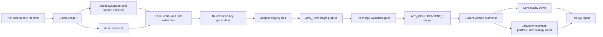

# feat: Build APS markdown note adapter validation prototype

## Overview

Build the first production prototype of a markdown-note adapter and validation pipeline for the APS generic content model. The prototype should ingest 20-30 representative APS notes, emit rows aligned to the v2 `CONTENT_*` contract, merge them safely into Snowflake, and produce a QA report that decides whether the model is ready for a review app.

This plan does not redesign the schema. It treats the current v2 model, ingestion contract, core SQL, quality views, and mart views as source of truth. The work is about proving the model on real markdown-converted notes and hardening the adapter/load path around deterministic keys, idempotency, anchors, dates, and validation.

## Problem Frame

APS needs confidence that broad PM notes, strategy notes, portfolio updates, markdown exports, and image-heavy notes can land canonically before app work starts. The risk is not whether a parser can produce rows once. The risk is whether the ingestion path remains stable across re-runs, re-exports, moved files, revised notes, missing dates, unresolved entities, multiple investments, portfolio-level content, and strategy-level recurring notes.

The prototype should answer one CEO-level question: can APS safely treat the generic content layer as the durable upstream intake model for real note data, while deriving investment/portfolio/strategy views conservatively enough for a review app?

## Requirements Trace

- R1. The markdown/bundle adapter emits `CONTENT_ITEMS`, `CONTENT_VERSIONS`, `CONTENT_BODIES`, `CONTENT_ASSETS`, `CONTENT_SCOPES`, `CONTENT_ENTITY_LINKS`, and `CONTENT_DATES` candidates.
- R2. Deterministic key generation follows `docs/aps_content_ingestion_contract.md` exactly, with the `CONTENT_SCOPES` key derived from the v2 DDL table comment because the contract key block does not list that formula.
- R3. Snowflake load logic is idempotent, merge-key-driven, and prevents silent duplicate item/version/current-version corruption.
- R4. The pilot run covers 20-30 representative notes, including recurring strategy notes, portfolio notes, image-heavy notes, undated notes, and multi-entity notes.
- R5. The QA harness reports duplicate item/version key issues, missing primary bodies, unresolved entity mentions, missing body anchors, missing operational dates, derived note counts, and false-positive/false-negative entity examples.
- R6. Success criteria clearly decide whether to proceed to app build, iterate on adapter/model usage, or pause for schema/contract hardening.
- R7. Existing QPR, valuation, and investment-note flows remain compatible and are not replaced by this prototype.
- R8. `INVESTMENT_NOTES_FROM_CONTENT`, portfolio derivations, and strategy derivations are validated as derived outputs, not treated as canonical intake.

## Scope Boundaries

- Do not change the `APS_CORE.CONTENT_*` canonical schema as part of this prototype.
- Do not build the review app, UI workflows, permissions, or human review screens.
- Do not replace the current `INVESTMENT_NOTES` flow. Validate compatibility through derived content views only.
- Do not build a full knowledge graph, assertion extraction system, or production LLM review workflow.
- Do not require perfect OCR or image understanding. Preserve image assets and evaluate whether available OCR/captions/context are sufficient.
- Do not bulk backfill all APS notes. Limit the validation run to a curated 20-30 note pilot.
- Do not silently coerce missing investment names or missing dates into fake values. Sparse truth is valid data.

### Deferred to Separate Tasks

- Review app implementation: only starts after this plan's app-readiness criteria pass.
- Full APS historical backfill: follows after the pilot proves idempotency, dedupe, anchors, and date behavior.
- Advanced entity-resolution service: can be introduced later if the prototype shows dictionary/rule-based resolution is insufficient.
- Production OCR/caption pipeline: can be added later if image-heavy notes routinely fail `IMAGE_HEAVY_NO_EXTRACTED_CONTEXT`.

## Context & Research

### Relevant Code and Patterns

- `docs/aps_generic_content_model.md` defines the content-first canonical model and the canonical-vs-derived boundary.
- `docs/aps_content_ingestion_contract.md` defines adapter output, deterministic keys, merge order, item/version rules, re-export behavior, entity anchoring, date candidates, and P1 quarantine rules.
- `sql/aps_core/001_content_canonical_model.sql` defines the v2 `APS_CORE.CONTENT_*` tables and comments that business keys and health views are part of the ingestion contract because Snowflake standard-table constraints are not fully enforced.
- `sql/aps_core/002_investment_notes_from_content.sql` defines investment, portfolio, and strategy derivations from content.
- `sql/aps_core/003_content_quality_views.sql` defines `APS_CORE.CONTENT_REVIEW_ISSUES`, including duplicate keys, current-version issues, primary-body issues, reviewed-link issues, scope conflicts, image-heavy no context, missing body anchors, and missing operational dates.
- `sql/aps_mart/001_content_marts.sql` defines app/reporting-facing timelines and `APS_MART.CONTENT_REVIEW_QUEUE`.
- `examples/acceptance_queries.sql` provides acceptance-query patterns that the pilot should extend rather than bypass.

### External References

- Snowflake `MERGE` documentation notes that duplicate source rows can create nondeterministic update/delete behavior and recommends ensuring at most one source row matches each target row before merge. This supports pre-merge duplicate checks and source de-duplication by merge key. See [Snowflake MERGE](https://docs.snowflake.com/en/sql-reference/sql/merge).
- Snowflake transaction documentation describes transactions as atomic units that are committed or rolled back together. This supports running core merge steps in one transaction per adapter batch where possible. See [Snowflake Transactions](https://docs.snowflake.com/en/sql-reference/transactions).
- Snowflake constraints documentation notes that standard-table primary, unique, and foreign-key constraints are metadata and not generally enforced, except always-enforced `NOT NULL` and `CHECK`. This supports treating quality views and loader checks as required controls rather than relying on DDL uniqueness alone. See [Snowflake Constraints](https://docs.snowflake.com/en/sql-reference/constraints).

## Key Technical Decisions

- Use a bundle-oriented adapter, not a markdown-only parser: Markdown is the current adapter input, but the adapter should accept a bundle manifest that can point to markdown, images, source metadata, optional OCR/captions, and source-system identifiers.
- Emit staging records first, not direct core writes: The adapter writes deterministic row candidates and raw audit artifacts; Snowflake SQL owns merge semantics, current-version promotion, and quality gates.
- Treat `CONTENT_ITEM_KEY` and `CONTENT_VERSION_KEY` as the primary business keys: Deterministic IDs can be generated from those keys, but all load idempotency and dedupe checks are business-key-first.
- Promote current versions only in the loader: The adapter may indicate candidate/current intent, but Snowflake load logic must ensure exactly one current version pointer per item.
- Require body anchors for multi-investment and mixed-scope derivations: Whole-document summary fallback is acceptable only when content is single-scope or the entity is genuinely document-level.
- Use deterministic dictionary/rule-based entity resolution for the pilot: The prototype should measure unresolved mentions and false positives/negatives before adding heavier entity-resolution infrastructure.
- Preserve all meaningful date candidates and let v2 selected operational date logic choose the operational date: The adapter should not collapse dates into one convenient `EFFECTIVE_DATE`.
- Use `CONTENT_REVIEW_ISSUES` and `CONTENT_REVIEW_QUEUE` as the canonical QA source: The harness should add pilot-level metrics and samples, not duplicate business rules in application code.
- Gate app build on validation evidence, not optimism: Passing one ingestion run is insufficient; reruns, re-exports, and representative edge cases must pass the stated criteria.

## Open Questions

### Resolved During Planning

- Should this prototype redesign the content model? No. It must use the v2 schema and SQL files as source of truth.
- Should low-confidence content be forced into investment notes for app timelines? No. Low-confidence or unanchored links should remain canonical content and appear in review queues.
- Should markdown be assumed canonical? No. Markdown is one adapter input format; the canonical output is `CONTENT_*` rows.

### Deferred to Implementation

- Exact source-system names and object IDs for pilot notes: determine from the real APS file locations and bundle metadata available at implementation time.
- Exact existing APS entity reference tables for investments, portfolios, and strategies: wire the dictionary provider to the available APS reference sources during implementation.
- Exact OCR/caption availability for image-heavy bundles: detect from pilot files and report gaps rather than blocking the adapter.
- Exact Snowflake environment variables/connection names: follow local deployment conventions when the loader is implemented.

## Output Structure

The file tree is the intended prototype shape. It is a scope declaration, not an instruction to redesign repo conventions if implementation reveals a better local pattern.

```text
adapters/
  markdown_notes/
    README.md
    manifest.schema.json
    fixtures/
      pilot_manifest.example.json
      synthetic_notes/
    src/
      aps_markdown_notes/
        cli.py
        manifest.py
        normalize.py
        keys.py
        bundle_reader.py
        markdown_parser.py
        body_sections.py
        asset_extractor.py
        scope_classifier.py
        entity_linker.py
        date_extractor.py
        staging_writer.py
        validation_report.py
    sql/
      001_pre_merge_validation.sql
      002_merge_content_items.sql
      003_merge_content_versions.sql
      004_merge_content_children.sql
      005_validation_metrics.sql
    tests/
      test_manifest_contract.py
      test_normalize.py
      test_keys.py
      test_markdown_parser.py
      test_body_sections.py
      test_asset_extractor.py
      test_scope_classifier.py
      test_entity_linker.py
      test_date_extractor.py
      test_staging_writer.py
      test_validation_report.py
docs/
  pilots/
    aps_markdown_note_pilot_runbook.md
    aps_markdown_note_pilot_results_template.md
sql/
  aps_raw/
    001_content_adapter_stage_tables.sql
```

## High-Level Technical Design

> *This illustrates the intended approach and is directional guidance for review, not implementation specification. The implementing agent should treat it as context, not code to reproduce.*



## Pipeline Stages

1. Pilot corpus selection: curate 20-30 notes with a manifest that labels expected edge-case coverage and optional expected entities/dates for QA sampling.
2. Bundle discovery: read each note bundle, source metadata, markdown file, linked images/assets, optional OCR/caption files, and source provenance.
3. Source normalization: normalize source system, object ID, URI/path, title, timestamps, and source container before key generation.
4. Markdown parse: produce a primary document body plus section bodies where headings, tables, image anchors, or entity-specific sections exist.
5. Asset extraction: preserve linked/embedded image and attachment metadata, hash assets when accessible, attach assets to section bodies when possible, and record extraction status/context.
6. Scope classification: emit one or more scope rows such as `STRATEGY`, `PORTFOLIO`, `INVESTMENT`, `MULTI_INVESTMENT`, `MIXED`, or `UNKNOWN` with confidence/evidence.
7. Entity linking: resolve investment, portfolio/fund, strategy/topic, company, person, and unresolved mentions with evidence, confidence, review status, mention spans where available, and body/asset anchors.
8. Date extraction: emit all meaningful date candidates, including meeting date, report-period start/end, source-created, source-modified, ingested, and effective-date candidates.
9. Key generation: generate deterministic keys and deterministic IDs from normalized source identity and content fingerprints.
10. Staging emission: write normalized candidate rows to local JSONL/CSV artifacts and/or Snowflake staging tables, with one ingestion run ID.
11. Pre-merge validation: fail or quarantine batch subsets with duplicate merge keys, conflicting payloads, missing primary bodies, invalid required columns, or multiple current candidates.
12. Snowflake merge: merge items, versions, current-version pointer, bodies, assets, scopes, entity links, and dates in contract order.
13. Quality evaluation: query core quality views and mart review queue, then produce a pilot report with metrics, examples, and readiness recommendation.

## Pilot Validation Run

The pilot should be intentionally small but adversarial. Select notes to prove the model survives the known APS edge cases rather than sampling only easy notes.

Suggested 20-30 note mix:

- 4-6 recurring strategy-level notes, including PEP Weekly-style and BTS Monthly-style examples with no required investment.
- 3-5 portfolio-level notes, including SAIF Portfolio Redemption-style examples where portfolio/fund scope is valid without an investment.
- 3-5 single-investment notes to ensure the new path still supports straightforward investment derivation.
- 3-5 multi-investment notes where section-level anchors should produce separate investment-derived rows.
- 2-4 image-heavy notes, including Decarb Partners Fund I Q4 2025 Webcast-style bundles with linked images and partial or missing OCR/captions.
- 2-3 undated or weakly dated notes that should remain canonical without fake operational dates.
- 2-3 duplicate, re-exported, revised, or moved-file examples to validate item/version and current-version rules.
- 1-2 mixed-scope notes that intentionally combine strategy, portfolio, and investment commentary.
- 1-2 notes with unresolved or ambiguous entity mentions to validate review queue behavior.

Each pilot note should be labeled in the manifest with expected edge-case categories and, where practical, expected entities/date candidates for QA sampling. Labels are not canonical truth; they are pilot-review scaffolding for measuring false positives and false negatives.

At least 10 pilot notes should receive lightweight manual expectations for scope, key entities, and obvious date candidates before the validation report is generated. Without this small labeled subset, false-negative reporting becomes anecdotal rather than measurable.

## Deterministic Key Contract

The implementation must mirror `docs/aps_content_ingestion_contract.md` rather than inventing adapter-local keys.

- `CONTENT_ITEM_KEY`: `SOURCE_SYSTEM`, plus stable `SOURCE_OBJECT_ID` when available; otherwise normalized source URI; otherwise source container and normalized source path.
- `CONTENT_VERSION_KEY`: `CONTENT_ITEM_KEY`, plus `SOURCE_VERSION_ID` when available; otherwise `CONTENT_FINGERPRINT`; otherwise `SOURCE_FILE_HASH`.
- `CONTENT_BODY_KEY`: `CONTENT_VERSION_KEY`, body role, section path or `document`, and normalized body hash or body hash.
- `CONTENT_ASSET_KEY`: `CONTENT_VERSION_KEY`, source asset URI/file name/asset order, and asset hash or `no_hash`.
- `CONTENT_SCOPE_KEY`: `CONTENT_VERSION_KEY`, scope type, and scope entity ID/name, following the DDL comment in `sql/aps_core/001_content_canonical_model.sql`.
- `CONTENT_ENTITY_LINK_KEY`: `CONTENT_VERSION_KEY`, entity type, entity ID or normalized entity name, content body ID/content asset ID/document anchor, and mention span when available.
- `CONTENT_DATE_KEY`: `CONTENT_VERSION_KEY`, date type, and date value/timestamp/period/text.

Deterministic IDs should be namespaced hashes of their corresponding business keys. The generated IDs must be stable across reruns and environments, but merge semantics must still rely on the business keys above.

## Snowflake Merge/Load Approach

The loader should follow the v2 merge order exactly:

1. Normalize adapter output into staging rows.
2. Merge `CONTENT_ITEMS` by `CONTENT_ITEM_KEY`.
3. Merge `CONTENT_VERSIONS` by `CONTENT_VERSION_KEY`.
4. Promote exactly one current version per content item when the incoming version is truly current.
5. Merge `CONTENT_BODIES` by `CONTENT_BODY_KEY`.
6. Merge `CONTENT_ASSETS` by `CONTENT_ASSET_KEY`.
7. Merge `CONTENT_SCOPES` by `CONTENT_SCOPE_KEY`.
8. Merge `CONTENT_ENTITY_LINKS` by `CONTENT_ENTITY_LINK_KEY`.
9. Merge `CONTENT_DATES` by `CONTENT_DATE_KEY`.
10. Query `CONTENT_REVIEW_ISSUES` and quarantine P1 records from app promotion.

Loader hardening rules:

- Stage rows include `INGESTION_RUN_ID`, raw record ID, adapter name/version, source bundle path/reference, row hash, and payload hash for auditability.
- Pre-merge validation rejects a batch when a merge key maps to conflicting staged payloads in the same batch.
- Exact duplicate staged rows can be collapsed only when row hashes match; conflicting duplicates must be reported.
- Merge source subqueries must provide at most one row per target merge key.
- The loader should set or rely on Snowflake's default nondeterministic-merge protection, but must not depend on it as the only guard.
- Steps that mutate `APS_CORE` should run in one transaction per adapter batch when the environment supports it.
- Current-version promotion should be atomic with version merge and pointer update.
- If a batch produces multiple current-version candidates for one content item, do not promote either automatically; surface a P1 conflict for review.

Item/version behavior:

- New logical note with no existing `CONTENT_ITEM_KEY`: insert one content item and one initial content version, then promote that version.
- Re-export with the same fingerprint and same version key: update item/source metadata and last-seen timestamps; do not create or promote a second current version.
- Re-export with a different source version ID but identical content fingerprint: insert an optional duplicate version only if audit requirements need it, mark it duplicate, and do not promote it.
- Moved file with stable source object ID: keep the same item, update source path/URI metadata, and avoid a new version unless fingerprint changes.
- Moved file without stable source object ID: use fingerprint reconciliation; exact body+asset fingerprint matches can mark duplicate items, while uncertain matches stay separate and require review.
- Revised note with the same item key and different fingerprint: create a new version, mark old current as `SUPERSEDED`, promote the new version, and update `CONTENT_ITEM_CURRENT_VERSION`.

## Implementation Units

- [ ] **Unit 1: Define the markdown bundle manifest and pilot corpus contract**

**Goal:** Define the input contract for real note bundles and the pilot selection process.

**Requirements:** R1, R4, R8

**Dependencies:** None

**Files:**
- Create: `adapters/markdown_notes/README.md`
- Create: `adapters/markdown_notes/manifest.schema.json`
- Create: `adapters/markdown_notes/fixtures/pilot_manifest.example.json`
- Create: `docs/pilots/aps_markdown_note_pilot_runbook.md`
- Test: `adapters/markdown_notes/tests/test_manifest_contract.py`

**Approach:**
- Define a bundle manifest with source system, source object ID, source URI/path/container, source title, source created/modified/exported timestamps, markdown path, asset paths, optional OCR/caption paths, expected edge-case labels, and optional expected entity/date samples.
- Require the manifest to distinguish source identity metadata from parser-derived content metadata.
- Include pilot selection guidance for 20-30 notes: strategy recurring, portfolio-level, image-heavy, undated, multi-entity, revised/re-exported, moved-file candidates, and mixed-scope notes.
- Keep source-specific fields in metadata/provenance rather than adding canonical schema fields.

**Execution note:** Start with contract tests before implementing parser behavior, because downstream key stability depends on manifest normalization.

**Patterns to follow:**
- Required adapter output in `docs/aps_content_ingestion_contract.md`.
- Source provenance and lineage fields in `sql/aps_core/001_content_canonical_model.sql`.

**Test scenarios:**
- Happy path: manifest with stable source object ID, markdown file, two image assets, and source timestamps validates successfully.
- Happy path: manifest without source object ID but with source container/path validates and records the identity fallback method.
- Edge case: undated note manifest validates when source created/modified dates are missing except ingestion metadata.
- Edge case: image-heavy manifest validates with OCR/caption files present for only some images.
- Error path: manifest missing markdown path or source identity fallback fails validation before parsing.
- Error path: manifest with duplicate bundle IDs fails validation.

**Verification:**
- A pilot manifest can describe all required note categories without needing schema changes.
- Invalid input fails before Snowflake staging.

- [ ] **Unit 2: Implement normalization and deterministic key generation**

**Goal:** Produce stable normalized source values, content fingerprints, merge keys, and deterministic IDs aligned to the v2 contract.

**Requirements:** R2, R3

**Dependencies:** Unit 1

**Files:**
- Create: `adapters/markdown_notes/src/aps_markdown_notes/normalize.py`
- Create: `adapters/markdown_notes/src/aps_markdown_notes/keys.py`
- Test: `adapters/markdown_notes/tests/test_normalize.py`
- Test: `adapters/markdown_notes/tests/test_keys.py`

**Approach:**
- Implement project-standard normalization for whitespace, case where appropriate, URL decoding, path separator cleanup, markdown body normalization, and stable hash inputs.
- Generate all required keys using the formulas in `docs/aps_content_ingestion_contract.md`.
- Implement `CONTENT_SCOPE_KEY` using the DDL comment in `sql/aps_core/001_content_canonical_model.sql`: `CONTENT_VERSION_KEY + scope type + entity id/name`.
- Generate deterministic IDs from namespaced hashes of business keys, while preserving business keys as the merge keys.
- Record `ITEM_IDENTITY_METHOD` such as `SOURCE_OBJECT_ID`, `NORMALIZED_URI`, `CONTAINER_PATH`, or `CONTENT_HASH_RECONCILED`.

**Execution note:** Implement this unit test-first; key drift is the highest-risk failure mode for idempotency.

**Patterns to follow:**
- Deterministic key section in `docs/aps_content_ingestion_contract.md`.
- Business-key comments in `sql/aps_core/001_content_canonical_model.sql`.

**Test scenarios:**
- Happy path: source object ID present produces the same `CONTENT_ITEM_KEY` even if file path changes.
- Happy path: no source object ID falls back to normalized URI, then container/path when URI is unavailable.
- Happy path: same normalized body and assets produce the same `CONTENT_FINGERPRINT` across reruns.
- Edge case: URL encoding, case differences, duplicate slashes, and path separators normalize to one stable source identity.
- Edge case: body hash changes when material markdown text changes but not when trailing whitespace changes.
- Edge case: asset key uses asset hash when present and `no_hash` fallback when unavailable.
- Error path: missing required source identity inputs prevents item key generation.
- Integration: two synthetic bundles representing a moved file with stable object ID generate the same item key and version key when fingerprint is unchanged.

**Verification:**
- Key fixtures match the documented formulas exactly.
- Running key generation twice over the same fixtures produces byte-for-byte identical output.

- [ ] **Unit 3: Parse markdown bundles into bodies and assets**

**Goal:** Convert markdown and linked files into primary body, section bodies, and asset candidates with anchors.

**Requirements:** R1, R4, R5

**Dependencies:** Units 1 and 2

**Files:**
- Create: `adapters/markdown_notes/src/aps_markdown_notes/bundle_reader.py`
- Create: `adapters/markdown_notes/src/aps_markdown_notes/markdown_parser.py`
- Create: `adapters/markdown_notes/src/aps_markdown_notes/body_sections.py`
- Create: `adapters/markdown_notes/src/aps_markdown_notes/asset_extractor.py`
- Test: `adapters/markdown_notes/tests/test_markdown_parser.py`
- Test: `adapters/markdown_notes/tests/test_body_sections.py`
- Test: `adapters/markdown_notes/tests/test_asset_extractor.py`

**Approach:**
- Emit exactly one primary document body per content version unless the markdown is truly empty or unreadable, in which case the record should surface `MISSING_PRIMARY_BODY`.
- Emit section bodies for headings, entity-specific subsections, report sections, and image/table context blocks.
- Preserve parent/child body structure using `PARENT_CONTENT_BODY_ID` where section hierarchy is available.
- Attach assets to the nearest section body when possible; otherwise attach at document level with extraction status and evidence.
- Populate asset type, role, source URI/path, hash, OCR text, caption text, extraction status, and metadata when available.

**Patterns to follow:**
- `CONTENT_BODIES` and `CONTENT_ASSETS` definitions in `sql/aps_core/001_content_canonical_model.sql`.
- Image-heavy review issue logic in `sql/aps_core/003_content_quality_views.sql`.

**Test scenarios:**
- Happy path: markdown note with headings produces one primary body and multiple section bodies with stable section paths.
- Happy path: linked image in a section produces a `CONTENT_ASSETS` row anchored to that section body.
- Happy path: image asset with OCR/caption files includes extracted context and avoids being counted as context-free.
- Edge case: markdown with no headings still emits one primary body.
- Edge case: duplicate image references produce deterministic asset keys without duplicate conflicting rows.
- Edge case: relative image paths resolve against the bundle root.
- Error path: missing linked image records an asset candidate with extraction failure metadata instead of crashing the whole bundle.
- Integration: multi-investment markdown with separate investment sections produces body anchors that entity links can target.

**Verification:**
- Every successfully parsed bundle emits at least one primary body candidate.
- Image-rich notes preserve asset rows and available context rather than collapsing images into body text.

- [ ] **Unit 4: Extract scopes, entity links, and date candidates**

**Goal:** Emit reviewable scope classifications, entity links with evidence/anchors, and date candidates without overclaiming certainty.

**Requirements:** R1, R4, R5, R8

**Dependencies:** Units 1-3

**Files:**
- Create: `adapters/markdown_notes/src/aps_markdown_notes/scope_classifier.py`
- Create: `adapters/markdown_notes/src/aps_markdown_notes/entity_linker.py`
- Create: `adapters/markdown_notes/src/aps_markdown_notes/date_extractor.py`
- Test: `adapters/markdown_notes/tests/test_scope_classifier.py`
- Test: `adapters/markdown_notes/tests/test_entity_linker.py`
- Test: `adapters/markdown_notes/tests/test_date_extractor.py`

**Approach:**
- Use deterministic rules and reference dictionaries for investment, portfolio/fund, strategy/topic, company, person, and unresolved mention candidates.
- Assign `LINK_ROLE` based on evidence: `DOCUMENT_SUBJECT` or `PRIMARY_SUBJECT` for document-level subjects; `MENTION` for incidental mentions; section-scoped roles when evidence is section-specific.
- Anchor entity links to section bodies when the entity applies to a section, especially for multi-investment and mixed-scope notes.
- Emit unresolved entity mentions with `ENTITY_NAME`, mention context, confidence, and `REVIEW_STATUS = 'NEEDS_REVIEW'` or equivalent, not as dropped data.
- Classify strategy-level, portfolio-level, investment-level, multi-investment, mixed, and unknown scopes with evidence and confidence.
- Emit all meaningful date candidates and mark `IS_PRIMARY_CANDIDATE` only when source evidence is strong.

**Patterns to follow:**
- Entity anchoring rules in `docs/aps_content_ingestion_contract.md`.
- `CONTENT_SCOPES`, `CONTENT_ENTITY_LINKS`, and `CONTENT_DATES` tables in `sql/aps_core/001_content_canonical_model.sql`.
- Operational date selection logic in `sql/aps_core/002_investment_notes_from_content.sql`.

**Test scenarios:**
- Happy path: strategy recurring note such as a PEP Weekly-style bundle emits strategy scope and strategy/topic link without investment link.
- Happy path: portfolio note such as an SAIF redemption-style bundle emits portfolio scope and portfolio/fund link without inventing an investment.
- Happy path: single-investment note emits investment scope and a document-level investment entity link.
- Happy path: multi-investment note emits one content item, multiple investment entity links, and section body anchors for section-specific links.
- Edge case: mixed-scope note emits `MIXED` or multiple scope rows and requires anchors for app derivations.
- Edge case: unresolved entity mention is preserved with evidence and does not block canonical ingestion.
- Edge case: undated note emits source/ingested date candidates only when available and otherwise remains valid with missing operational date.
- Edge case: note with meeting date and report period emits multiple date candidates rather than collapsing them.
- Error path: ambiguous entity dictionary match is marked for review and excluded from high-confidence derived notes.
- Integration: derived investment notes do not use generic whole-note summary when an investment link is section-anchored.

**Verification:**
- No-investment, portfolio-only, strategy-only, multi-investment, mixed, and undated notes all produce valid canonical candidates.
- Entity-link examples are explainable through evidence text and anchors.

- [ ] **Unit 5: Emit staging artifacts and Snowflake stage tables**

**Goal:** Convert adapter candidates into loadable staging records with auditability and schema checks.

**Requirements:** R1, R2, R3

**Dependencies:** Units 1-4

**Files:**
- Create: `adapters/markdown_notes/src/aps_markdown_notes/staging_writer.py`
- Create: `sql/aps_raw/001_content_adapter_stage_tables.sql`
- Test: `adapters/markdown_notes/tests/test_staging_writer.py`

**Approach:**
- Define staging records that mirror the target `APS_CORE.CONTENT_*` columns plus ingestion-run audit fields.
- Persist adapter output as deterministic JSONL or CSV artifacts for local inspection before Snowflake load.
- Provide Snowflake stage tables in `APS_RAW` or adapter-local stage tables that can be truncated by `INGESTION_RUN_ID` without affecting canonical data.
- Validate required fields, type compatibility, JSON/VARIANT serializability, timestamp formatting, numeric confidence ranges, and key uniqueness before load.
- Keep raw payload locations and normalized payload locations available for lineage.

**Patterns to follow:**
- APS_RAW role described in `docs/aps_generic_content_model.md`.
- Merge sketch and merge order in `docs/aps_content_ingestion_contract.md`.

**Test scenarios:**
- Happy path: complete adapter candidates serialize to staging files with all required target columns.
- Happy path: VARIANT-like metadata/evidence/provenance serializes in a Snowflake-loadable format.
- Edge case: optional dates, entity IDs, OCR text, and asset hashes can be null without breaking serialization.
- Error path: missing primary key fields, invalid confidence values, or malformed timestamps fail local staging validation.
- Error path: duplicate business key with conflicting payload is reported before Snowflake load.
- Integration: staged rows for a representative bundle can be grouped by ingestion run ID across all `CONTENT_*` outputs.

**Verification:**
- The adapter can produce deterministic staging artifacts for all synthetic fixture categories.
- Staging artifacts contain enough audit fields to reproduce and debug a pilot row.

- [ ] **Unit 6: Implement pre-merge validation and core merge SQL**

**Goal:** Safely load staged rows into Snowflake with deterministic merge behavior, current-version promotion, and duplicate/re-export handling.

**Requirements:** R3, R5, R8

**Dependencies:** Unit 5

**Files:**
- Create: `adapters/markdown_notes/sql/001_pre_merge_validation.sql`
- Create: `adapters/markdown_notes/sql/002_merge_content_items.sql`
- Create: `adapters/markdown_notes/sql/003_merge_content_versions.sql`
- Create: `adapters/markdown_notes/sql/004_merge_content_children.sql`
- Test: `adapters/markdown_notes/tests/test_merge_sql_contract.py`

**Approach:**
- Pre-merge validation checks one row per merge key, conflicting duplicate payloads, required non-null fields, orphaned child references, multiple current candidates, missing primary body, and key formula presence.
- Item merge updates source metadata and `LAST_SEEN_AT` for existing item keys without creating duplicate content items.
- Version merge inserts revised versions when fingerprints differ, records duplicate versions when configured and justified, and does not promote duplicate re-exports.
- Current-version promotion updates old current versions to `SUPERSEDED`, marks the new version current, and upserts `CONTENT_ITEM_CURRENT_VERSION`.
- Child merges load bodies, assets, scopes, entity links, and dates only after item/version IDs are resolved.
- Post-merge validation queries `APS_CORE.CONTENT_REVIEW_ISSUES` and blocks P1 records from app-readiness promotion.

**Patterns to follow:**
- Merge order in `docs/aps_content_ingestion_contract.md`.
- Current-version pointer table in `sql/aps_core/001_content_canonical_model.sql`.
- Quality gates in `sql/aps_core/003_content_quality_views.sql`.
- Snowflake deterministic merge guidance from official `MERGE` docs.

**Test scenarios:**
- Happy path: initial ingest inserts item, version, current pointer, primary body, scope, entity links, and dates.
- Happy path: rerunning the same batch does not create additional content items, versions, bodies, assets, scopes, entity links, or dates.
- Happy path: revised note creates a new version and supersedes the prior current version.
- Happy path: moved file with stable source object ID updates path/URI metadata without a new current version when fingerprint is unchanged.
- Edge case: re-export with identical fingerprint and different export ID does not create multiple current versions.
- Edge case: moved file without stable object ID and exact fingerprint match is marked duplicate/reviewable rather than silently creating two app-visible items.
- Error path: two staged rows with same version key but conflicting fingerprints block merge.
- Error path: two staged current candidates for one content item block promotion and surface a conflict.
- Integration: after load, `CONTENT_REVIEW_ISSUES` has no P1 issues for clean fixtures and has expected issue codes for intentionally bad fixtures.

**Verification:**
- A repeated load is idempotent.
- At most one current pointer and one current version flag exist per content item after successful clean loads.
- P1 records are discoverable and excluded from app-readiness decisions.

- [ ] **Unit 7: Build the pilot QA harness and validation report**

**Goal:** Measure whether the model and adapter behavior are good enough for app build using real pilot notes.

**Requirements:** R4, R5, R6, R8

**Dependencies:** Units 1-6

**Files:**
- Create: `adapters/markdown_notes/src/aps_markdown_notes/validation_report.py`
- Create: `adapters/markdown_notes/sql/005_validation_metrics.sql`
- Create: `docs/pilots/aps_markdown_note_pilot_results_template.md`
- Test: `adapters/markdown_notes/tests/test_validation_report.py`

**Approach:**
- Query core quality views, mart review queue, derived note views, and adapter staging statistics for one ingestion run.
- Produce a report with aggregate metrics, edge-case coverage, issue counts, examples, and app-readiness recommendation.
- Include a manual sampling section for false-positive and false-negative entity-link examples, using expected labels from the pilot manifest where available.
- Separate measured false negatives from qualitative misses. Measured false negatives require manually labeled expected entities or dates in the pilot manifest.
- Separate "canonical ingestion validity" from "derived app-readiness"; a note can ingest successfully while still requiring review before appearing in timelines.
- Make the report reproducible by recording ingestion run ID, adapter version, pilot manifest version, Snowflake database/schema context, and source bundle list.

**Patterns to follow:**
- `APS_CORE.CONTENT_REVIEW_ISSUES` in `sql/aps_core/003_content_quality_views.sql`.
- `APS_MART.CONTENT_REVIEW_QUEUE` and timeline marts in `sql/aps_mart/001_content_marts.sql`.
- `examples/acceptance_queries.sql` for acceptance-query style.

**Test scenarios:**
- Happy path: clean synthetic pilot report shows zero P1 issues, derived note counts, and expected coverage by edge-case label.
- Happy path: report counts investment, portfolio, and strategy derived notes separately.
- Edge case: undated notes appear as valid canonical records with missing operational date metric, not as failed ingestion.
- Edge case: image-heavy note with no OCR/caption context appears in image-heavy no context metrics.
- Edge case: unresolved mentions are counted and sampled with evidence.
- Error path: duplicate keys or multiple current versions appear as blocking readiness failures.
- Integration: a pilot report can compare expected manifest entities against actual entity links and produce false-positive/false-negative examples.

**Verification:**
- The report answers whether the v2 model is ready for app build with objective metrics and concrete examples.
- The report can be re-run for the same ingestion run and produce stable counts.

## Test Plan

Use a layered test strategy:

- Contract tests: validate manifest structure, required adapter outputs, deterministic key formulas, and staging row schemas.
- Parser tests: validate markdown body extraction, section hierarchy, image references, missing assets, and image context handling.
- Entity/date tests: validate scope classification, entity resolution, unresolved mention handling, body anchors, and multiple date candidates.
- Loader tests: validate pre-merge duplicate detection, rerun idempotency, revised-note behavior, moved-file behavior, and current-version promotion.
- Quality tests: validate known bad fixtures trigger expected `CONTENT_REVIEW_ISSUES` issue codes.
- Pilot validation: run the adapter against 20-30 real notes and manually inspect sampled false positives/false negatives.

Representative fixtures should include:

- Strategy recurring note with no investment.
- Portfolio-level note with no investment.
- Single-investment note.
- Multi-investment note with distinct sections.
- Mixed strategy and investment commentary.
- Undated note.
- Note with meeting date and report-period dates.
- Image-heavy webcast-style note with linked assets and partial OCR/captions.
- Re-exported note with identical fingerprint.
- Revised note with changed body fingerprint.
- Moved file with stable source object ID.
- Moved file without stable source object ID.
- Note with unresolved entity mentions.

## Validation Metrics

The pilot report should include these metrics at minimum:

- `pilot_note_count`: number of source bundles attempted.
- `loaded_content_item_count`: number of loaded content items for the ingestion run.
- `loaded_content_version_count`: number of loaded content versions for the ingestion run.
- `content_body_count` and `primary_body_count`.
- `content_asset_count` and image-like asset count.
- `content_scope_count` by scope type.
- `content_entity_link_count` by entity type, review status, and anchor scope.
- `content_date_count` by date type.
- Duplicate item key issue count.
- Duplicate version key issue count.
- Multiple current version flag/pointer issue count.
- Missing primary body count.
- Missing reviewed entity link count.
- Unresolved entity mention count.
- Missing investment body anchor count.
- Missing portfolio body anchor count.
- Missing strategy body anchor count.
- Missing operational date count.
- Image-heavy notes with no extracted context count.
- Derived investment note count from `APS_CORE.INVESTMENT_NOTES_FROM_CONTENT`.
- Derived compatibility note count from `APS_CORE.INVESTMENT_NOTES_COMPAT_FROM_CONTENT`.
- Derived portfolio note count from `APS_CORE.PORTFOLIO_NOTES_FROM_CONTENT`.
- Derived strategy note count from `APS_CORE.STRATEGY_NOTES_FROM_CONTENT`.
- Mart investment timeline count from `APS_MART.INVESTMENT_NOTE_TIMELINE_FROM_CONTENT`.
- Mart portfolio timeline count from `APS_MART.PORTFOLIO_NOTE_TIMELINE_FROM_CONTENT`.
- Mart strategy timeline count from `APS_MART.STRATEGY_NOTE_TIMELINE_FROM_CONTENT`.
- False-positive entity-link examples with evidence and reason.
- False-negative entity-link examples with expected entity and missing/failed evidence.
- Notes quarantined from app promotion by P1 issue code.
- Notes allowed into canonical store but requiring review by P2/P3 issue code.

## Success Criteria for App-Build Readiness

The model is ready to move to review-app build when all of these are true for the pilot:

- The same pilot can run twice without creating duplicate content items, duplicate versions, duplicate bodies/assets/scopes/entity links/dates, or multiple current versions.
- P1 issue count is zero after expected adapter fixes, excluding intentionally bad synthetic fixtures.
- Every successfully loaded current version has exactly one primary body.
- Every multi-investment or mixed-scope derived investment note is body-anchored, not derived from a generic whole-note fallback.
- Portfolio-level and strategy-level notes produce portfolio/strategy derivations or clear review issues without inventing investment names.
- Image-heavy notes preserve assets and either have extracted context or are flagged clearly by `IMAGE_HEAVY_NO_EXTRACTED_CONTEXT`.
- Undated notes remain queryable as canonical content and appear with missing operational date metrics rather than fake dates.
- Re-exported notes and moved files behave according to the item/version rules without creating app-visible duplicates.
- Revised notes create new versions and correctly supersede prior current versions.
- Manual entity-link sampling shows high enough precision to support a review app workflow. As a prototype threshold, target at least 85% precision on auto-accepted or approved high-confidence links in the sampled set, with false negatives documented by category.
- The labeled subset does not reveal a systemic false-negative pattern that hides an entire note category, such as portfolio-only notes, strategy recurring notes, or section-level investment mentions.
- Derived investment, portfolio, and strategy views produce plausible counts and examples for the curated pilot categories.
- The QA report gives clear examples for false positives, false negatives, unresolved mentions, and date ambiguity.

The model is not ready for app build if any of these hold:

- Any P1 issue remains unexplained or reproducible on clean pilot data.
- Rerunning the same pilot changes canonical counts unexpectedly.
- Multi-investment notes derive investment timelines without section/body anchors.
- Portfolio/strategy notes are routinely forced into investment-shaped records.
- Image-heavy notes lose asset context without review visibility.
- Entity-link false positives are common enough that reviewers would not trust the app timeline.

## Recommended Order of Build

1. Build Unit 1 and Unit 2 first: manifest contract, normalization, and deterministic keys are the foundation for every downstream safety property.
2. Build Unit 3 next: bodies and assets must exist before entity anchors can be trustworthy.
3. Build Unit 4 after section extraction: scope, entity, and date extraction should operate over body anchors, not raw markdown alone.
4. Build Unit 5 before touching Snowflake core tables: staging artifacts make adapter output inspectable and debuggable.
5. Build Unit 6 with synthetic fixtures before real notes: prove idempotency, current-version promotion, re-exports, moved files, and revised notes in controlled cases.
6. Build Unit 7 and run the 20-30 note pilot: produce the readiness report and only then decide whether app build should start.

## System-Wide Impact

- **Interaction graph:** The adapter feeds `APS_RAW` staging, then `APS_CORE.CONTENT_*`, then existing core/mart derivation views. It should not write directly to app timelines.
- **Error propagation:** Parser errors should be bundle-scoped where possible. Staging validation and P1 merge conflicts should block affected records from app promotion rather than corrupting canonical tables.
- **State lifecycle risks:** Current-version promotion is the highest-risk mutation. It must be transactionally tied to version merge and pointer update.
- **API surface parity:** Investment, portfolio, and strategy derivations should all be validated before app work so the review app is not accidentally investment-only.
- **Integration coverage:** Unit tests alone are insufficient. The pilot must prove rerun idempotency and edge-case behavior in Snowflake.
- **Unchanged invariants:** Missing investment and missing operational date remain valid canonical states. The prototype must not reintroduce investment-centric assumptions upstream.

## Risks & Dependencies

| Risk | Likelihood | Impact | Mitigation |
|------|------------|--------|------------|
| Real source bundles lack stable source object IDs | Medium | High | Use normalized URI/path fallback and fingerprint reconciliation; report moved-file uncertainty explicitly. |
| Entity dictionaries are incomplete or table names differ from expectations | Medium | Medium | Isolate dictionary provider behind adapter config; preserve unresolved mentions with evidence. |
| Markdown conversion loses structure needed for anchors | Medium | High | Use heading/table/image-context heuristics and measure missing anchor metrics in the pilot. |
| Image-heavy notes lack OCR/caption context | High | Medium | Preserve assets and flag `IMAGE_HEAVY_NO_EXTRACTED_CONTEXT`; do not block canonical ingestion unless primary body is missing. |
| Snowflake constraints do not enforce uniqueness | High | High | Use pre-merge validation, quality views, deterministic source subqueries, and rerun tests. |
| Reruns mutate metadata in ways that look like new versions | Medium | High | Separate source metadata updates from content fingerprint/version changes. |
| False-positive entity links pollute derived timelines | Medium | High | Conservative confidence thresholds, reviewed/auto-accepted statuses, body anchors, and manual sampling gate. |
| Pilot corpus is not representative | Medium | Medium | Select notes explicitly by edge-case category and include recurring strategy, portfolio, image-heavy, undated, multi-entity, re-export, revised, and mixed-scope examples. |

## Documentation / Operational Notes

- `adapters/markdown_notes/README.md` should explain bundle format, adapter outputs, deterministic key policy, staging artifacts, and pilot workflow.
- `docs/pilots/aps_markdown_note_pilot_runbook.md` should define how to select the pilot set, run the adapter, load Snowflake, and review results.
- `docs/pilots/aps_markdown_note_pilot_results_template.md` should provide a stable report format so future pilots are comparable.
- The implementation should record adapter version and ingestion run ID in every stage/load artifact.
- The app-build decision should be made from the pilot report, not from successful command completion alone.

## Sources & References

- Source model: `docs/aps_generic_content_model.md`
- Ingestion contract: `docs/aps_content_ingestion_contract.md`
- Canonical DDL: `sql/aps_core/001_content_canonical_model.sql`
- Core derivations: `sql/aps_core/002_investment_notes_from_content.sql`
- Quality views: `sql/aps_core/003_content_quality_views.sql`
- Mart views: `sql/aps_mart/001_content_marts.sql`
- Acceptance queries: `examples/acceptance_queries.sql`
- External docs: [Snowflake MERGE](https://docs.snowflake.com/en/sql-reference/sql/merge)
- External docs: [Snowflake Transactions](https://docs.snowflake.com/en/sql-reference/transactions)
- External docs: [Snowflake Constraints](https://docs.snowflake.com/en/sql-reference/constraints)
